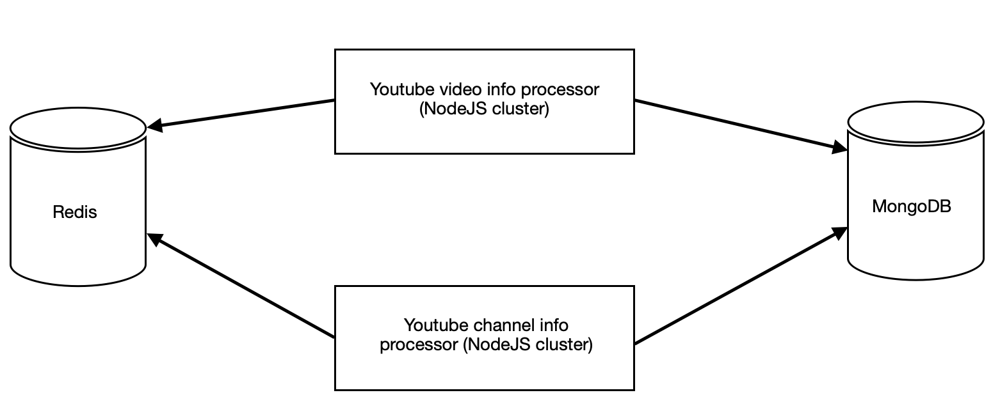
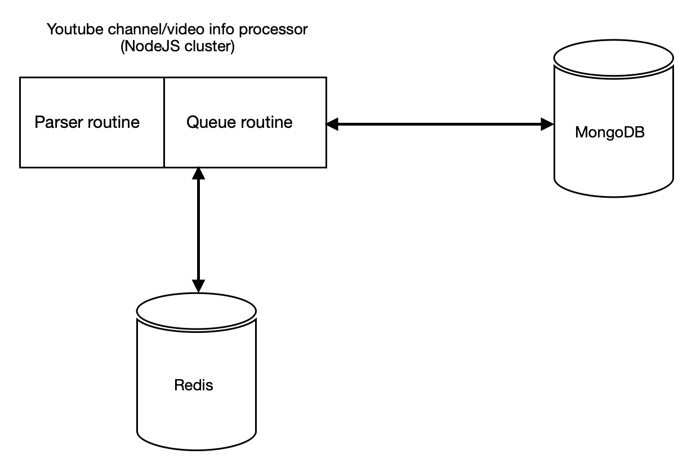

### Project's Goal
The goal of this project is to create a working code to simulate Youtube channel and video info parsing in bulk. The code must be optimized and scalable to the point where certain parts can be outsourced to different physically separated servers.

### YT HTML Hooks
#### Subscribers
```<yt-formatted-string id="subscriber-count" class="style-scope ytd-c4-tabbed-header-renderer" aria-label="13.1 million subscribers">13.1M subscribers</yt-formatted-string>```

#### Channel ID
look for "externalId" in channel's page code

### Channel name
```<yt-formatted-string id="text" link-inherit-color="" title="" class="style-scope ytd-channel-name">Ray William Johnson</yt-formatted-string>```

#### Channel views
```<span class="view-count style-scope ytd-video-view-count-renderer">2,021,899 views</span>```

### Prerequisites
- mongodb 4.x
- redis
- nodejs 17.x

### Seed database
Run ```node gen-channels-list``` to generate required (100 million) number of chanel IDs. It should take between 20-60 minutes depending on your hardware.

Run ```node seed-db``` to upload generated channel IDs into mongodb. It should take between 20-60 minutes depending on your hardware. It's highly advisable to create index in table ```channels``` for the following fields ```subscribersUpdatedAt, videosUpdatedAt, subscribers, videos```. The total channels DB size is around 10 GB. Each index is going to occupy about 500 mb of space. The same applies to table ```videos```, create index for the following fields ```updatedAt, views```.

### How to run
- start redis
- start mongod
- start ```node yt-mock-service```
- start ```node cluster``` (channel subscribers and video feed parsing)
- start ```node cluster video``` (channel videos parsing)

Current code is tested on the following hardware ```i3/ddr4/nvme``` (4 logical cores). It can be easily scaled by separating both clusters to run processing on dual processor systems. The code assumes best networking conditions and doesn't account for any delays, fetching/parsing errors and/or use of proxy servers which will be required for real life scenario. It's advisable to have at least 10-12 GB of ram due to overall database and indices size.

### System architecture
**MongoDB** - used as a persistent storage

**Redis** - used to create queues and manage workload and scale the system

**NodeJS cluster** - used to pull data from DB, manage queues, fetch and parse html data, upload parsed data to DB

There are 6 main stages involved in the whole process.
1) Get N records from DB
2) Add the records to a queue
3) Get one record from the queue
4) Fetch url
5) Parse html data
6) Update the record in DB

All 6 stages are implemented and coupled in NodeJS cluster. Records are processed in batches to manage workload and control resource consumption.

<table width="100%">
  <tr>
    <td align="center">
      <strong>System diagram</strong>
    </td>
  </tr>
  <tr>
    <td align="center">
      
    </td>
  </tr>
</table>

<table width="100%">
  <tr>
    <td align="center">
      <strong>NodeJS cluster diagram</strong>
    </td>
  </tr>
  <tr>
    <td align="center">
      
    </td>
  </tr>
</table>